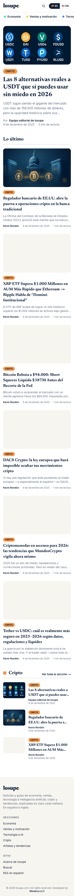
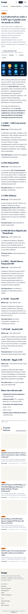
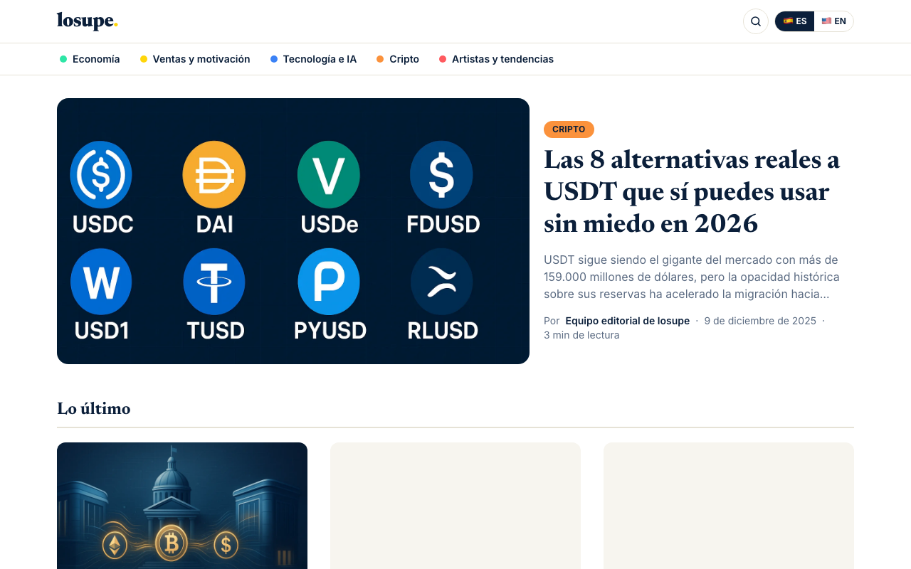

# losupe.com

Portal de noticias bilingüe (español / inglés) con un **robot redactor propio** que cada mañana lee
fuentes, elige temas, redacta notas nuevas, las ilustra y las publica. Todo vive dentro de
**YaDominios Cloud** (worker + base D1 + archivos R2 + cron), sin n8n ni servicios intermedios.

Nace de **MundosCrypto** (portal de criptomonedas): su archivo de noticias se conserva en la
sección Cripto.

| Pieza               | Tecnología                                                                                            |
| ------------------- | ----------------------------------------------------------------------------------------------------- |
| Sitio               | Next.js 16 (App Router) + Tailwind 4, empaquetado con OpenNext                                        |
| Plataforma          | YaDominios Cloud (`env.DB` D1, `env.BUCKET` R2, `env.ASSETS`, crons)                                  |
| Idiomas             | `/es/...` y `/en/...` con selector de banderas y respaldo al español                                  |
| Robot               | `GET /__scheduled` (programador de YaDominios) → `src/lib/robot/`                                     |
| Base autogestionada | El worker crea el esquema y siembra las noticias heredadas solo; estado en `GET /__health`            |
| Agentes de IA       | Markdown con `Accept: text/markdown`, `llms.txt`, Content Signals, `/.well-known/*`, WebMCP, IndexNow |
| Pruebas             | Vitest + Testing Library + msw (unitarias) · Playwright (humo e2e)                                    |
| Calidad/seguridad   | TypeScript estricto, ESLint + plugin security, gitleaks, CI                                           |

## Mapa del repo

```
schema.sql                 Esquema D1 idempotente (se incrusta en el worker; también lo corre YaDominios)
seed/legacy-mundoscrypto.sql  Noticias heredadas (se incrustan y se siembran solas una vez)
seed/content/*.mjs         Notas editoriales puntuales (ES/EN) que se publican al hacer push
scripts/embed-schema.mjs   Genera src/lib/schema-sql.ts y src/lib/seed-content.ts (antes de cada build)
worker.ts                  Worker de producción: envuelve Next (OpenNext), garantiza la base,
                           redirige por idioma y agrega /__health y /__scheduled
yadominios.json            Config que se publica (crons, flags)
wrangler.jsonc             Bindings locales para next dev / preview
src/app/[lang]/...         Portada, sección, artículo, autor, buscar, acerca, rss.xml, 404
src/app/{robots,sitemap}.ts, news-sitemap.xml/   SEO
src/i18n/                  Diccionarios ES/EN (mismas claves, hay prueba que lo exige)
src/lib/                   secciones, rutas, consultas D1, HTML, fechas, RSS, SEO, robot
src/components/            Header, Footer, LangSwitcher, ArticleCard, ...
scripts/                   import-mundoscrypto.ts · db-local.sh · db-remote-import.ts
tests/unit, tests/e2e      Pruebas
docs/                      Plan (PDF) y tutorial de publicación
```

## Comandos

```bash
npm install
npm run db:local        # crea/actualiza la base D1 local con esquema + noticias heredadas
npm run dev             # http://localhost:3000 (next dev con bindings locales)
npm run preview         # build OpenNext + wrangler dev en :8787 (igual que producción)
npm run verify          # tipos + lint + pruebas con cobertura + build + audit + gitleaks
npm run test:e2e        # prueba de humo contra el preview (:8787)
```

## Publicación

`git push` a `main` → el Action `build-para-yadominios-cloud` compila y deja el sitio en la rama
`yapanel-build` → YaDominios Cloud (conectado a esa rama) republica solo.
Paso a paso con croquis: [docs/publicar-en-yadominios.md](docs/publicar-en-yadominios.md).

## Marca y frente

- Video del frente: `public/video/hero-v2.mp4` (franja 3:1, 1600×532, 17,7 s, 1,2 MB; versión móvil
  `hero-v2-m.mp4`, 960×320, 0,4 MB) y póster `hero-v2-poster.jpg`. Vuelo cinematográfico entre los
  edificios de Manhattan al atardecer (Mixkit 30544, licencia Mixkit Free, sin atribución obligatoria);
  bucle sin corte por fundido cruzado (ffmpeg `xfade`), nunca en reversa. Se carga después de `load`
  (`HeroVideo`) y se omite con ahorro de datos o `prefers-reduced-motion`.
- Buscador profesional: índice FTS5 en D1 (`articles_fts`, `unicode61 remove_diacritics 2`, ranking
  `bm25`), sugerencias desde la primera letra (`GET /datos/buscar?q&lang&limit`, componente
  `SearchBox` con teclado y ARIA), sinónimos bilingües en `src/lib/search-synonyms.ts`
  (btc↔bitcoin, ia↔inteligencia artificial↔ai, dólar↔usd…), tolerante a acentos y con prefijos.
  El índice se reconstruye solo cuando cambia el esquema o entra una semilla (`rebuildSearchIndex`)
  y, si estuviera vacío, el guardián `searchIndexGuard` lo rellena en la primera búsqueda; si FTS
  fallara, cae a `LIKE` con sinónimos.
- Celular con figura de diario (23 ago 2026): barra superior fija con ☰ menú + logo + lupa
  (`Header.tsx` + `MobileMenu.tsx`, panel a pantalla completa con secciones, idioma y enlaces del
  sitio); las fichas de secciones se deslizan con la página. La búsqueda abre una hoja a pantalla
  completa (`SearchBox.tsx`, portal en `body`); «Lo último» y los bloques de sección son filas
  compactas con miniatura a la derecha (`ArticleCard` tarjeta = fila bajo `sm`), la etiqueta de
  sección va sobre la foto de la nota principal y los bloques no repiten notas ya mostradas.
  En escritorio la botonera navy sigue fija. Los arreglos con su prueba están en
  [docs/candados.md](docs/candados.md).
- Logo «losupe.com»: `src/components/Logo.tsx` (marca SVG: anillo degradado + arco y núcleo amarillos;
  wordmark Space Grotesk con degradado, punto amarillo y «.com»). Iconos y tarjeta social generados
  desde ahí (`src/app/icon.png`, `apple-icon.png`, `opengraph-image.png`, `public/brand/`).
- Autores: `equipo-losupe` (redacción), `kevin-rondon` (archivo de MundosCrypto) y **`magaly-molina`**
  (firma por defecto de lo nuevo: `settings.default_author`).
- Esquema versionado por huella: si `schema.sql` cambia, el worker lo reaplica solo
  (`settings.schema_hash`), así que agregar un autor o una columna es editar `schema.sql` y publicar.

## Publicar una nota a mano (sin panel todavía)

1. Crea `seed/content/AAAA-MM-DD-tema.mjs` copiando `seed/content/2026-08-23-mercatren.mjs` (artículo + `i18n.es` + `i18n.en`, imágenes en `public/img/notas/...`).
2. `npm run schema:embed` y `git push`. El worker la siembra en la primera visita (marca por huella: si editas la nota y vuelves a publicar, se actualiza).
3. Comprueba en `/__health` que la semilla aparece con `seeded: true`.

En el bloque 2 el robot y el panel escriben directo en la base; este camino queda para notas puntuales.

## Variables de entorno

Ver `.env.example`. Ninguna es obligatoria para arrancar. `CRON_SECRET` permite disparar el robot
a mano: `GET /__scheduled?key=<CRON_SECRET>`.

## Bloques de trabajo

1. **Cimientos y portal** — repo, blindaje, base, portal bilingüe, migración de MundosCrypto. ✅
2. **Robot redactor** — fuentes → curaduría → redacción ES/EN → imagen → revisión → publicar.
3. **Google y posicionamiento** — Publisher Center, IndexNow, perfiles de autor, Core Web Vitals.
4. **Suscriptores y boletín** — registro, confirmación, boletín cada 4 días.

Plan completo: [docs/plan-losupe-2026-08-22.pdf](docs/plan-losupe-2026-08-22.pdf).
SEO y descubrimiento por IA (checklist vivo): [docs/seo-y-descubrimiento.md](docs/seo-y-descubrimiento.md).

---

© 2026 losupe.com | All rights reserved. Developed by [Windoce LLC](https://windoce.com)

## Capturas (bloque 1)

| Portada (móvil)                          | Nota (móvil)                          | Portada (escritorio)                          |
| ---------------------------------------- | ------------------------------------- | --------------------------------------------- |
|  |  |  |
