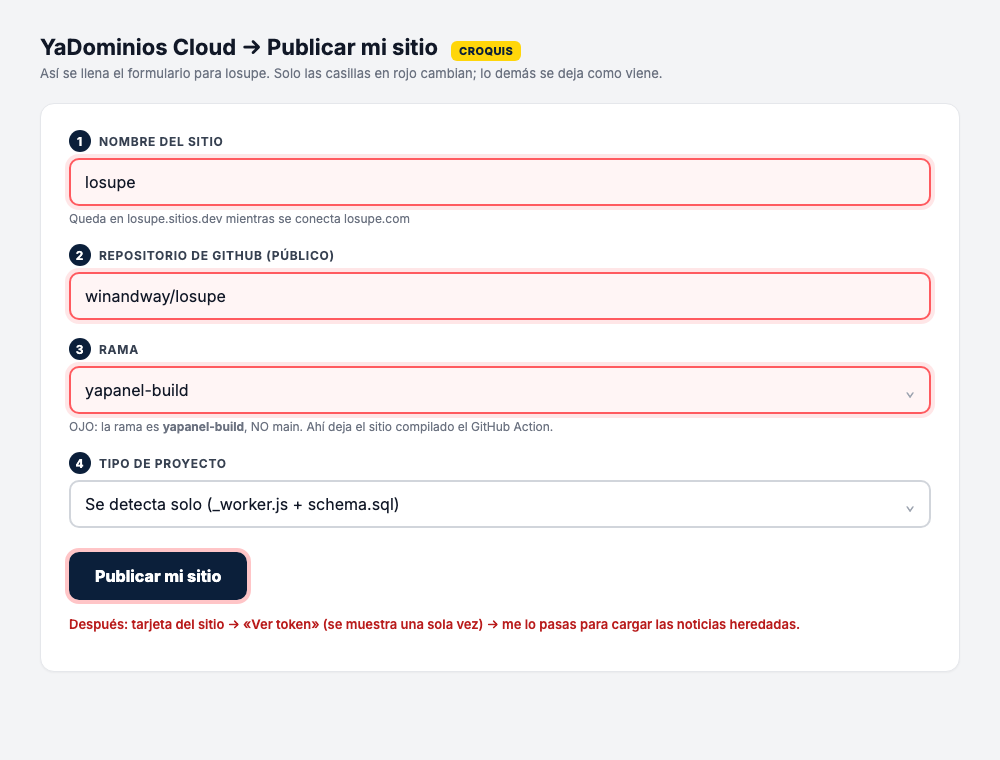

# Publicar losupe en YaDominios Cloud

Cada paso responde a cuatro cosas: **qué es**, **quién lo hace**, **qué pasa exactamente** y
**cómo se comprueba**. Guía oficial de la plataforma (manda si algo cambió):
https://yadominios.com/docs/publicar-en-yadominios-cloud

## 1. El repositorio compila solo

- **Qué es:** cada `git push` a `main` dispara el Action `build-para-yadominios-cloud`
  (`.github/workflows/build.yml`), que compila con OpenNext, empaqueta todo en un solo
  `_worker.js` y lo deja, junto con los estáticos, `schema.sql` y `yadominios.json`, en la rama
  **`yapanel-build`**.
- **Quién:** automático (GitHub).
- **Qué pasa:** la rama `yapanel-build` se reescribe entera en cada push (no se edita a mano).
- **Cómo se comprueba:** en GitHub → Actions → el job `build` en verde, y la rama `yapanel-build`
  contiene `_worker.js`, `schema.sql`, `yadominios.json` y la carpeta `_next/`.

## 2. Crear el sitio en el panel (una sola vez)

- **Qué es:** conectar el repo a YaDominios Cloud.
- **Quién:** Richard (dueño de la cuenta) o quien tenga acceso al panel.
- **Qué pasa:** en `yapanel.yadominios.com/panel/cloud` → «Publicar mi sitio», se llena así:



  Valores, casilla por casilla:

  - **Nombre del sitio:** `losupe`
  - **Repositorio:** `winandway/losupe`
  - **Rama:** `yapanel-build` (no `main`)

- **Cómo se comprueba:** `https://losupe.sitios.dev/es` abre la portada con las noticias
  heredadas (después del paso 3) y `https://losupe.sitios.dev/__scheduled` responde 404 (solo lo
  puede llamar el programador).

## 3. Cargar las noticias heredadas (una sola vez)

- **Qué es:** `schema.sql` crea las tablas y los datos base en cada publicación, pero las 33
  noticias de MundosCrypto se cargan aparte con la API de la base (valores parametrizados, sin
  riesgo al partir sentencias).
- **Quién:** yo, con el token del sitio que me pasa Richard (panel → tarjeta del sitio → «Ver
  token»; se muestra una sola vez y **nunca** se commitea).
- **Qué pasa:**

  ```bash
  cd /Users/windocellc/losupe.com && YADOMINIOS_SITE=losupe YADOMINIOS_SITE_TOKEN=<token> npx tsx scripts/db-remote-import.ts seed/legacy-mundoscrypto.sql
  ```

- **Cómo se comprueba:** `https://losupe.sitios.dev/es/cripto` lista las notas y
  `https://losupe.sitios.dev/sitemap.xml` las incluye.

## 4. Conectar el dominio losupe.com

- **Qué es:** que el sitio responda en `losupe.com` con HTTPS.
- **Quién:** Richard en el panel (plan Órbita o superior): tarjeta del sitio → «Conectar mi dominio
  propio» → `losupe.com` → el panel muestra dos nameservers que se pegan en el registrador (si el
  dominio se compra en YaDominios, queda conectado solo).
- **Cómo se comprueba:** `https://losupe.com/es` abre con candado y `https://losupe.sitios.dev`
  sigue funcionando.

## 5. El robot programado

- **Qué es:** `yadominios.json` declara el cron `0 11 * * *` (11:00 UTC = 6:00 am hora del este
  en invierno, 7:00 am en verano). A esa hora el programador de YaDominios llama
  `GET /__scheduled` con la cabecera `x-yad-cron`.
- **Qué pasa hoy (bloque 1):** el robot registra la corrida en la tabla `runs` y, como
  `robot_paused = 1`, no publica nada. En el bloque 2 entra el pipeline completo.
- **Cómo se comprueba:** en la base, `SELECT * FROM runs ORDER BY started_at DESC LIMIT 5`
  muestra una fila nueva cada mañana.

## Prueba de humo después de publicar (obligatoria)

Todas deben responder **200**: `/es`, `/en`, `/es/cripto`, `/en/crypto`, `/es/rss.xml`,
`/sitemap.xml`, `/news-sitemap.xml`, `/robots.txt`, `/icon.png`, `/opengraph-image.png`.
Si alguna falla, es una emergencia: se arregla y se vuelve a publicar de inmediato.
