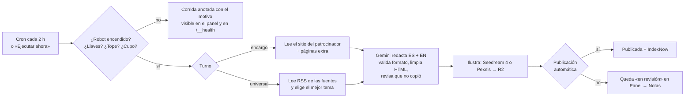
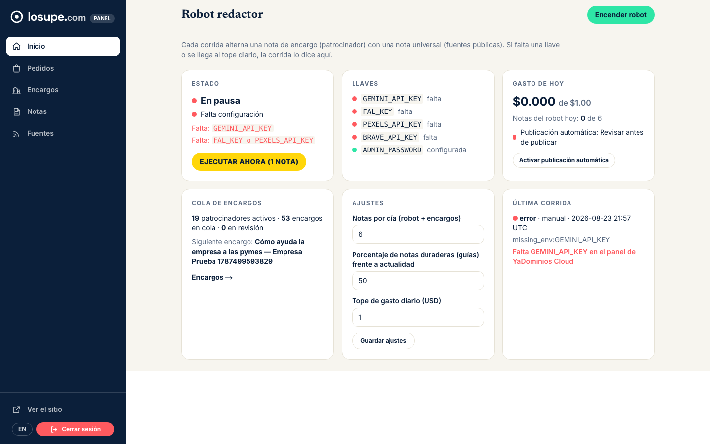
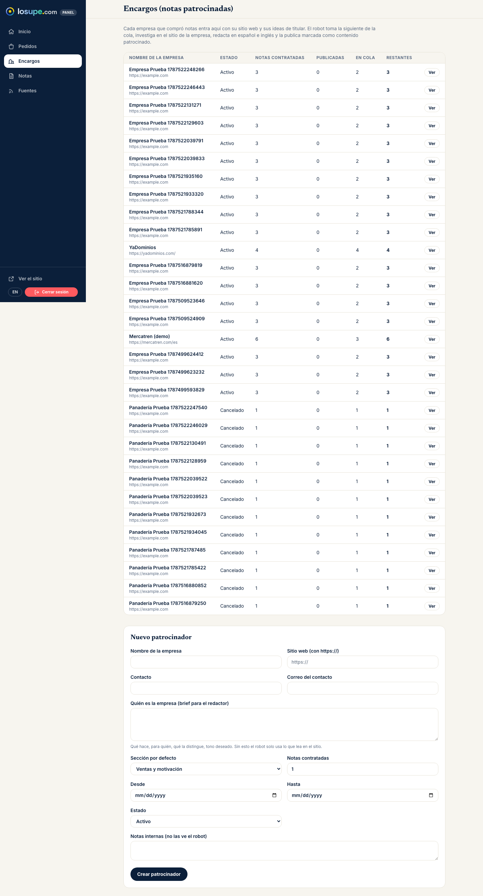
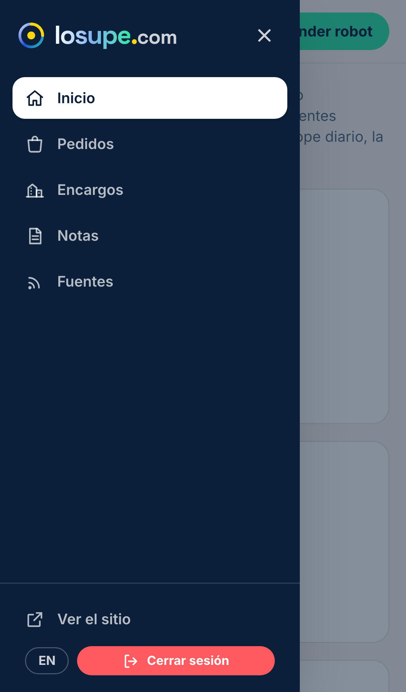
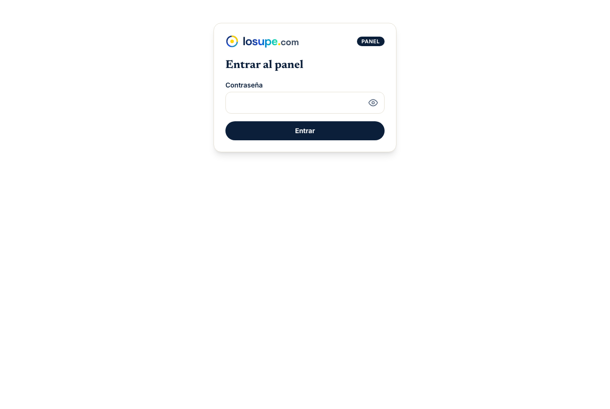

# El robot redactor y los encargos (notas patrocinadas)

> Bloque 2 de losupe.com (23 ago 2026). Este documento es el tutorial completo: qué es, quién hace
> qué, qué pasa por dentro y cómo se comprueba. Escrito para Richard y para cualquier IA que tome el
> proyecto sin memoria. Las capturas son del panel real.

## 1. La idea en un párrafo

losupe.com vende **notas por encargo** a empresas (patrocinadores): «te publico 6 notas al año»,
«una nota este mes». Cada empresa entra en el panel con su **sitio web** (de ahí sale la
documentación), su **brief** y una **lista de ideas de titular**. El robot toma la siguiente idea de
la cola, **lee el sitio de la empresa**, redacta la nota en **español e inglés** con Gemini, la
ilustra, la guarda y —si así está configurado— la publica marcada como **Contenido patrocinado**.
Después de cada encargo, la siguiente nota que escribe es **universal** (una noticia o guía de
economía, ventas, tecnología e IA, cripto o artistas, a partir de fuentes públicas). Y así alterna:
encargo, universal, encargo, universal… Todo queda anotado: cuántas notas le quedan a cada empresa,
qué escribió, cuánto costó.

## 2. Quién hace qué

| Paso                            | Quién                                                                          | Qué pasa                                                                                                                                                       | Cómo se comprueba                                                                     |
| ------------------------------- | ------------------------------------------------------------------------------ | -------------------------------------------------------------------------------------------------------------------------------------------------------------- | ------------------------------------------------------------------------------------- |
| Poner las llaves (una sola vez) | **Richard**                                                                    | Pega `ADMIN_PASSWORD`, `GEMINI_API_KEY` y `FAL_KEY` o `PEXELS_API_KEY` en YaDominios Cloud → sitio `losupe` → **Variables de entorno** → guardar → republicar. | `/__health` → `robot.missing` vacío; el panel → Inicio → «Llaves» todo en verde.      |
| Entrar al panel                 | Richard                                                                        | `https://losupe.com/panel` → contraseña (con ojito).                                                                                                           | Se ve «Robot redactor».                                                               |
| Crear el patrocinador           | Richard                                                                        | Panel → **Encargos** → «Nuevo patrocinador»: nombre, sitio web, brief, sección, notas contratadas, periodo.                                                    | Aparece en la tabla con «restantes».                                                  |
| Encolar las ideas               | Richard                                                                        | Dentro del patrocinador → «Agregar ideas de titular»: una por línea; tras `\|` la indicación. Opcional: fecha «no antes de» y páginas extra para leer.         | La lista muestra cada idea «En cola», con flechas para ordenar y «Cancelar encargo».  |
| Encender el robot               | Richard                                                                        | Panel → Inicio → **Encender robot**. Opcional: «Activar publicación automática» (si no, todo queda en revisión).                                               | «Estado: Encendido».                                                                  |
| Correr                          | **Robot** (cron cada 2 h, 11–23 UTC) o Richard con **Ejecutar ahora (1 nota)** | Alterna encargo/universal; anota la corrida.                                                                                                                   | Inicio → «Última corrida» muestra la nota, el costo o el error.                       |
| Revisar y publicar              | Richard                                                                        | Panel → **Notas** → «Esperando revisión» → Abrir / Publicar / Descartar.                                                                                       | La nota aparece en la portada con la etiqueta «Contenido patrocinado» si era encargo. |
| Ver lo que queda                | Richard                                                                        | Panel → Encargos: columna «restantes» por empresa.                                                                                                             | —                                                                                     |

## 3. El panel (`/panel`)

- **Entrar**: contraseña única (`ADMIN_PASSWORD`), campo con ojito, límite de 5 intentos por IP cada
  15 min, Turnstile opcional (`TURNSTILE_SITE_KEY` + `TURNSTILE_SECRET_KEY`; sin ellas el login
  funciona igual). La sesión vive en la base (`panel_sessions`, 7 días): **Cerrar sesión** la borra
  de verdad y recarga la página completa.
- **Inicio**: estado (pausa/encendido, llaves, tope diario y gasto, cupo del día, publicación
  automática), cola de encargos y última corrida con cada nota (o el error exacto).
- **Encargos**: patrocinadores (crear/editar), ideas en cola (agregar, ordenar, cancelar, reencolar),
  enlace a cada nota publicada.
- **Notas**: notas del robot en revisión (publicar / descartar) y publicadas (despublicar).
- **Fuentes**: canales RSS para las notas universales (encender/apagar, agregar). Vienen 13 de
  arranque: **Google Trends** (lo más buscado hoy en EE. UU., ES y EN; el robot descarta deportes,
  apuestas y sucesos, clasifica por sección y toma la fuente más confiable), Bing Noticias por tema,
  The Verge, Google AI blog, CoinDesk, Cointelegraph ES, Billboard, Entrepreneur.
- **Ajustes** (Inicio): notas por día, porcentaje de guías duraderas frente a actualidad, tope diario.
- Idioma del panel con el botón **EN/ES** (cookie), todo el texto vive en `src/i18n/{es,en}.ts → panel`.

El panel se maneja con una **barra lateral** fija (en celular se abre con el botón de menú): Inicio,
Pedidos, Encargos, Notas y Fuentes, con avisos numerados en Pedidos y Notas cuando hay algo por
atender, y abajo «Ver el sitio», el cambio de idioma y **Cerrar sesión**. Desde el sitio público se
entra por el enlace «Entrar al panel» del pie de página (y del menú en celular).

## 4. Qué hace el robot por dentro (archivos)

| Pieza             | Archivo                                     | Qué hace                                                                                                                                                                                                                                      |
| ----------------- | ------------------------------------------- | --------------------------------------------------------------------------------------------------------------------------------------------------------------------------------------------------------------------------------------------- |
| Entrada           | `worker.ts` → `src/lib/robot/scheduled.ts`  | `/__scheduled` (cabecera `x-yad-cron` o `?key=CRON_SECRET`) y el cron de `yadominios.json` (`0 11-23/2 * * *`).                                                                                                                               |
| Pipeline          | `src/lib/robot/pipeline.ts`                 | Corrida completa: pausa → llaves → tope → cupo → descubrir RSS → alternar → investigar → redactar → ilustrar → guardar → IndexNow. Todo anotado en `runs` / `run_items`.                                                                      |
| Cola              | `src/lib/robot/queue.ts`                    | Patrocinadores y encargos (`sponsors`, `assignments`); siguiente encargo listo (periodo, fecha, notas restantes); alternancia (`settings.robot_last_kind`).                                                                                   |
| Universal         | `src/lib/robot/universal.ts`                | Parser RSS/Atom (incluye Bing News), candidatos (`candidates`), cupo por sección (`sections.notes_per_day`), lectura de la fuente.                                                                                                            |
| Investigación     | `src/lib/robot/research.ts`                 | Lee la portada del sitio del patrocinador, elige sus páginas explicativas (nosotros, cómo funciona, precios, FAQ, prensa…) y páginas extra; texto plano limpio. Brave News opcional.                                                          |
| Redactor          | `src/lib/robot/writer.ts`                   | Prompt (reglas: original, sin inventar, citar con enlaces, tono «pensar en grande con los pies en la tierra», ES neutro + EN nativo), validación zod, limpieza HTML, **anticopia** (≤ 8 % de fragmentos de 8 palabras iguales a las fuentes). |
| Gemini            | `src/lib/robot/gemini.ts`                   | REST `generateContent`, JSON forzado, llave en cabecera, costo por tokens. Modelo: `gemini-2.5-flash`.                                                                                                                                        |
| Imágenes          | `src/lib/robot/images.ts`                   | Seedream 4 (fal.ai, $0.03) → Pexels (gratis, crédito) → sin imagen. Guarda en R2 (`/media/notas/...`).                                                                                                                                        |
| Candados de costo | `src/lib/robot/model-guard.ts`, `budget.ts` | Lista blanca de modelos (tope $0.05/imagen), lista negra explícita, `assert` delante de cada llamada; tope diario `settings.daily_budget_usd` (hoy **$1.00**) con `spend_log`.                                                                |
| Publicación       | `src/lib/robot/publish.ts`                  | Inserta artículo + ES/EN, slugs únicos, índice de búsqueda, estado `review` o `published`; etiqueta de patrocinador para la nota.                                                                                                             |

**Firmas (23 ago 2026):** el equipo son tres personas reales —**Andreea Blidar** (economía y
tecnología), **Merry Melina** (artistas, tendencias y negocios) y **Pedro Llerena** (cripto y
emprendimiento)—, cada una con su foto y su ficha. El robot **reparte las notas por turnos**
(`src/lib/robot/authors.ts`): para cada nota elige primero entre quienes tienen esa sección como
especialidad y, dentro de ese grupo, al que lleva más tiempo sin publicar. Así rota solo y ninguna
firma se repite siempre. Magaly Molina no llegó a incorporarse: quedó inactiva y sus notas pasaron
al equipo actual (la de Mercatren la firma Merry Melina, porque Pedro Llerena es el protagonista de
esa nota y no puede firmarla).

Ajustes en `settings`: `robot_paused` (1/0), `robot_auto_publish` (0/1), `notes_per_day` (6),
`robot_notes_per_run` (1), `daily_budget_usd` (1.00), `evergreen_ratio` (0.7), `default_author`
(`magaly-molina`), `robot_last_kind`.

## 5. Las llaves: de dónde salen y dónde van

Todas van en **YaDominios Cloud → tarjeta del sitio `losupe` → Variables de entorno** (nombre exacto
→ valor), luego **Guardar** y **republicar** (o esperar al siguiente push). Nunca en el repo.

| Variable                                      | Para qué                                                | De dónde sale                     | Cuenta                                |
| --------------------------------------------- | ------------------------------------------------------- | --------------------------------- | ------------------------------------- |
| `ADMIN_PASSWORD`                              | Entrar al panel                                         | Richard la inventa (larga, única) | —                                     |
| `GEMINI_API_KEY`                              | Redactar (sin ella el robot no escribe y lo dice)       | Google AI Studio → _Get API key_  | **Prepago** / con tope de facturación |
| `FAL_KEY`                                     | Imágenes Seedream 4 ($0.03 c/u)                         | fal.ai → _Keys_                   | **Prepago**                           |
| `PEXELS_API_KEY`                              | Fotos gratis con crédito (alternativa a fal)            | pexels.com/api                    | Gratis                                |
| `BRAVE_API_KEY`                               | Opcional: buscar noticias además de RSS                 | brave.com/search/api              | $5 gratis/mes                         |
| `TURNSTILE_SITE_KEY` / `TURNSTILE_SECRET_KEY` | Opcional: escudo anti-robots del login                  | Cloudflare → Turnstile            | Gratis                                |
| `CRON_SECRET`                                 | Disparar el robot a mano por URL (`/__scheduled?key=…`) | Richard la inventa                | —                                     |

Con `GEMINI_API_KEY` y `ADMIN_PASSWORD` ya se puede probar todo (las notas saldrán sin imagen hasta
que haya `FAL_KEY` o `PEXELS_API_KEY`; el panel lo avisa).

## 6. Cómo probarlo de punta a punta

1. Poner `ADMIN_PASSWORD` y `GEMINI_API_KEY` en YaDominios; republicar.
2. `https://losupe.com/__health` → `robot.keys.gemini: true`, `robot.keys.admin: true`.
3. Entrar a `https://losupe.com/panel`, crear un patrocinador real (p. ej. Mercatren con
   `https://mercatren.com/es`), encolar 2–3 ideas.
4. Inicio → **Encender robot** → **Ejecutar ahora (1 nota)**. En 30–90 s la «Última corrida» muestra
   la nota (en revisión) o el error exacto.
5. **Notas** → Abrir → leer → **Publicar**. La nota sale en la portada con «Contenido patrocinado».
6. Volver a «Ejecutar ahora»: la siguiente será universal (si hay candidatos en las fuentes).

## 6.b Escribir una nota a mano (Panel → Escribir)

Dos formas, las dos terminan en una nota bilingüe lista para revisar:

- **«Le doy el tema y mis apuntes, y la IA la escribe»**: se escribe el titular, lo que se sabe y las
  fuentes (una URL por línea). La IA redacta con las mismas reglas del robot y **no inventa fuentes**.
- **«Ya la escribí yo, solo tradúcela y maquétala»**: respeta el texto tal cual —solo corrige
  ortografía y lo maqueta—, escribe la versión en inglés y completa extracto, meta y etiquetas.

Se elige sección, tipo, firma (por turno o una concreta) y si sale publicada o queda en revisión.

## 6.c Avisos por correo

Al publicarse una nota (robot, encargo o escrita a mano) se manda un aviso corto con el titular, la
entradilla y el enlace, usando el **correo transaccional de YaDominios Cloud** incluido en el plan
(`src/lib/mail.ts`; no hace falta SMTP ni proveedor externo). Va a dos sitios:

- **El equipo:** los correos que se guardan en Panel → Inicio → «Avisos por correo». No se muestran
  en el sitio. Hay un botón para mandarse una prueba.
- **Los suscriptores:** quien se apunte en el bloque del final de la portada. Con **doble
  confirmación** (nadie queda apuntado sin tocar el enlace de su correo) y con enlace de baja en cada
  aviso, para no ser spam.

Variables necesarias: `YAD_SITE`, `YAD_TOKEN` (panel → «Ver token»), `MAIL_FROM` (de un dominio
conectado al sitio) y opcionalmente `MAIL_FROM_NAME`. Límite por plan: 50/100/300/1.000 correos al
día; al pasarse se pausa hasta el día siguiente, sin cobros sorpresa.

## 7. Qué falta / siguiente

- Llaves (arriba). Sin `GEMINI_API_KEY` nada se redacta.
- «Rubros más buscados» (tendencias) para elegir temas universales: hoy se usan RSS por sección;
  Brave News entra solo si hay llave. Google Trends no tiene API pública estable.
- Bloque 3 (Google / Publisher Center) y bloque 4 (suscriptores y boletín) siguen pendientes.
- Los candados de este bloque están en [candados.md](candados.md).
